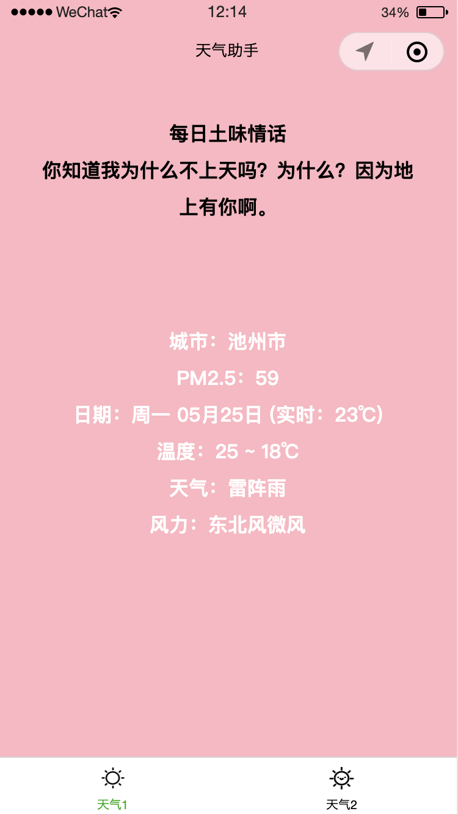
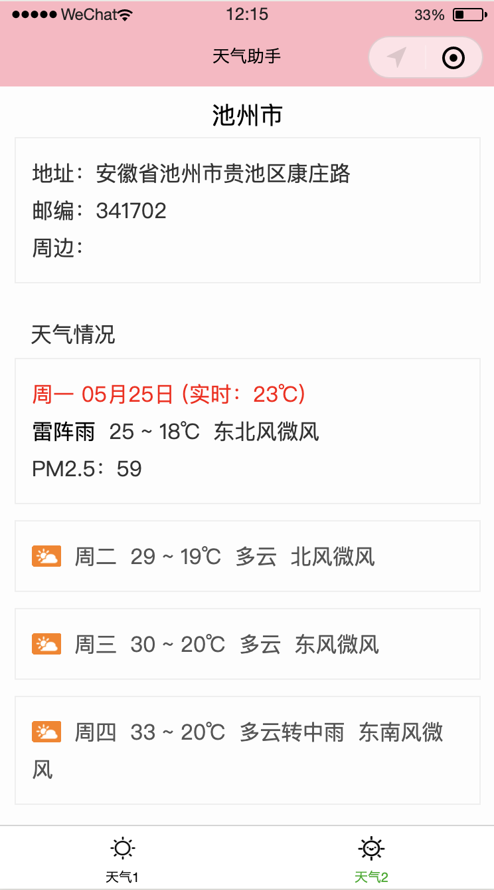

# Baidu-Weather

## 界面展示

<table>
    <tr>
        <td >

        
</td>
        <td >

        
</td>
    </tr>
</table>

-----------------

## 使用方法

在[百度开放平台](http://lbsyun.baidu.com/index.php?title=wxjsapi)申请ak，然后在app.js中替换 `bmap_ak: '你的ak'` 。

